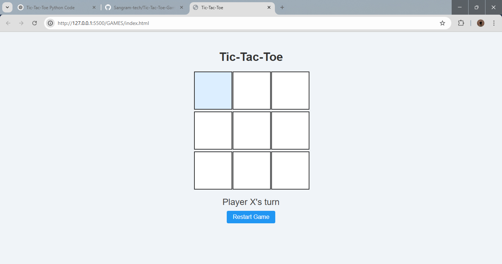
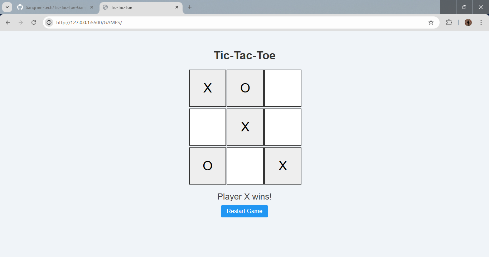
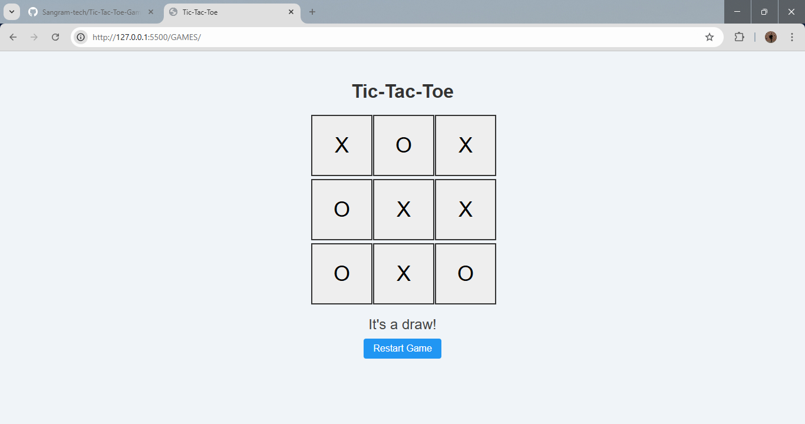

## Tic-Tac-Toe Game

This is a simple web-based Tic-Tac-Toe game built using HTML, CSS, and JavaScript.

## 🌐 Live Demo

> 💻 **[👉 Click here to run the app instantly](https://sangram-tech.github.io/TODO-APP/
)**  
> *(Replace this link with your real GitHub Pages or CodePen URL)*

---

##  Features

Two-player game (Player X and Player O)

Basic win/draw logic

Click-to-play interface

Restart button to play again

##  How to Use

1. Download or Clone the Repository

git clone https://github.com/sangram-tech/tic-tac-toe.git

2. Open the Game

Navigate to the project folder

Open index.html in any modern web browser

3. Play the Game

Players take turns clicking the empty cells.

The game will announce the winner or a draw.

Click "Restart Game" to play again.

##  File Structure

tic-tac-toe/
├── index.html        # Main HTML file
├── style.css         # (Optional if CSS is separated)
├── script.js         # (Optional if JS is separated)
└── README.md         # This file

## Screenshot
 
 
 

## License

This project is open-source and free to use under the MIT License.

---

Enjoy the game!

